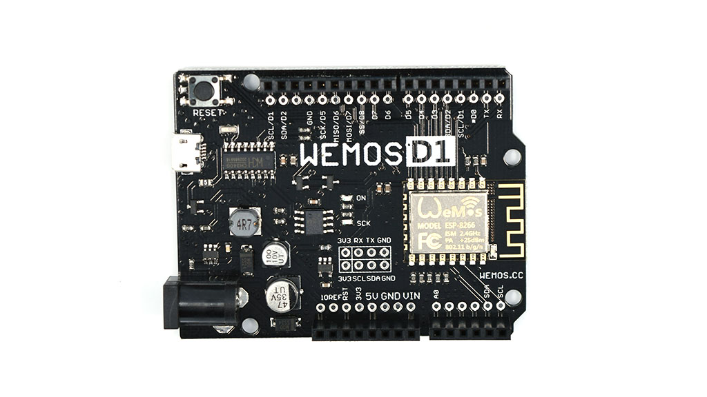
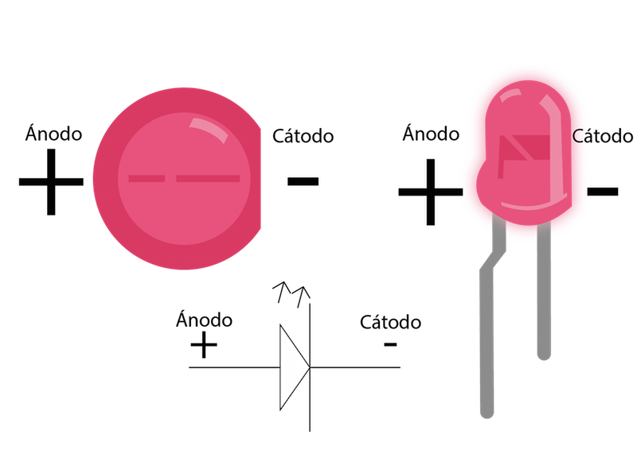
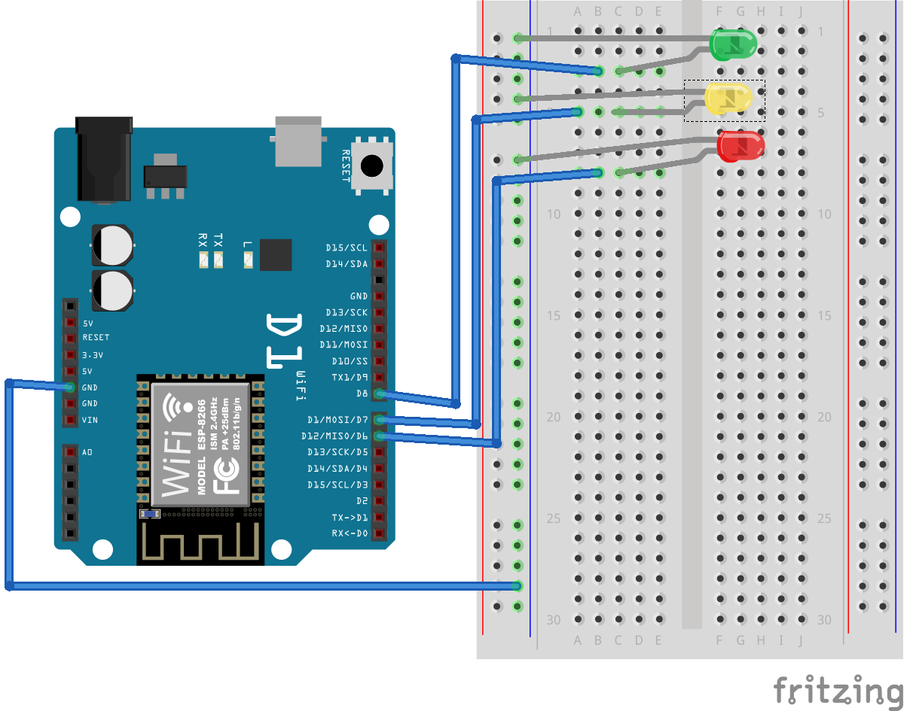
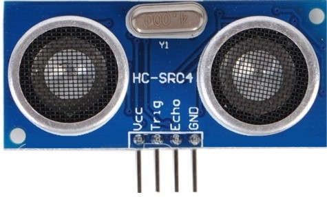
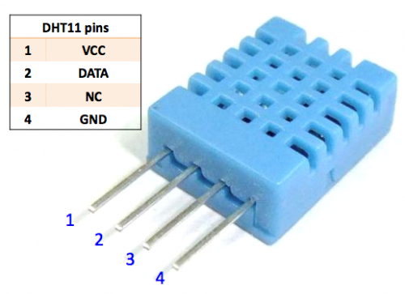
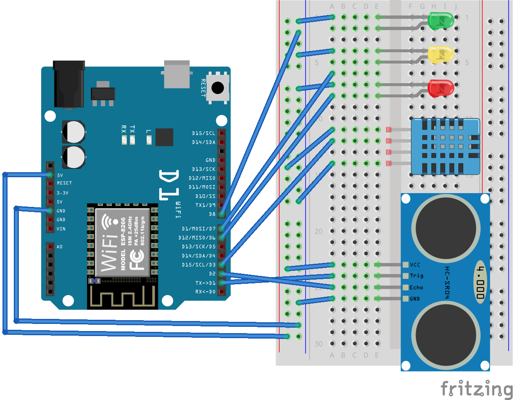
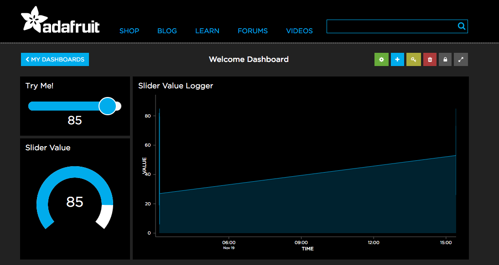

# Codemotion Spain 2016

Ejemplos usados en el workshop **[«Experimentando con chismes y cacharros»][1]**.  
[Codemotion Spain 2016][2]. Madrid, 19 de Noviembre de 2016.

**«Experimentando con chismes y cacharros»** es un workshop de:
- [Miguel Ángel López  - @MiguelAngel_LV][3]
- [José Juan Sánchez - @josejuansanchez][4]

## Descripción del workshop:

* ¿Has conseguido que tu madre entienda la diferencia entre **Arduino** y **Raspberry Pi**?
* ¿Crees que es más cómodo coger tu smartphone **Android**, desbloquearlo, buscar la app, conectar el **Bluetooth**, esperar a que sincronice, y finalmente pulsar un botón que estirar el brazo y encender manualmente la lámpara?
* ¿Has usado *«porque puedo»* como excusa ante algún **experimento absurdo**?
* ¿Cuando ves luces de Navidad ves accesorios para **Arduino**?

Si tu respuesta a las preguntas anteriores es afirmativa no deberías perderte este workshop, este es tu sitio.

## Requisitos para el workshop

### 1. Instalar PlatformIO IDE

* [Descargar Platform IO IDE][platformio-ide]

### 2. Instalar driver para el chip CH340 / USB to UART

* Windows: [CH341SER_win.zip][6]
* Mac OS X:
  * [>= El Capitan][7]
  * [Versiones más antiguas][8]
  * [Más información][9]
* Linux: Not need setup driver.

## Wemos D1

[Más información][5].

## Ejercicio 02 - semáforo

### Pinout Led

### Schematic

## Ejercicio 03 - distancia

### Pinout hc-sr04

### Schematic

## Ejercicio 04 - humedad

### Pinout dht11

### Schematic

## Ejercicio 05 - Adafruit IO

### Referencias

* [Adafruit IO][io-adafruit]
* [Adafruit MQTT library][adafruit-mqtt]

## Ejercicio 08 - «Smart Choza Coche» y Bot de Telegram

### Referencias

* [Universal Telegram Bot Library][bot-telegram]

[1]: https://2016.codemotion.es/agenda.html#5716304078045184/84674010
[2]: http://2016.codemotion.es
[3]: http://twitter.com/MiguelAngel_LV
[4]: http://twitter.com/josejuansanchez
[5]: https://www.wemos.cc/product/d1.html
[6]: https://www.wemos.cc/downloads/CH341SER_win.zip
[7]: https://www.wemos.cc/downloads/CH34x_Install_mac.zip
[8]: https://www.wemos.cc/downloads/CH341SER_MAC_old.ZIP
[9]: http://kig.re/2014/12/31/how-to-use-arduino-nano-mini-pro-with-CH340G-on-mac-osx-yosemite.html

[platformio-ide]: http://platformio.org/platformio-ide
[io-adafruit]: https://io.adafruit.com
[adafruit-mqtt]: https://github.com/adafruit/Adafruit_MQTT_Library
[bot-telegram]: https://github.com/witnessmenow/Universal-Arduino-Telegram-Bot
